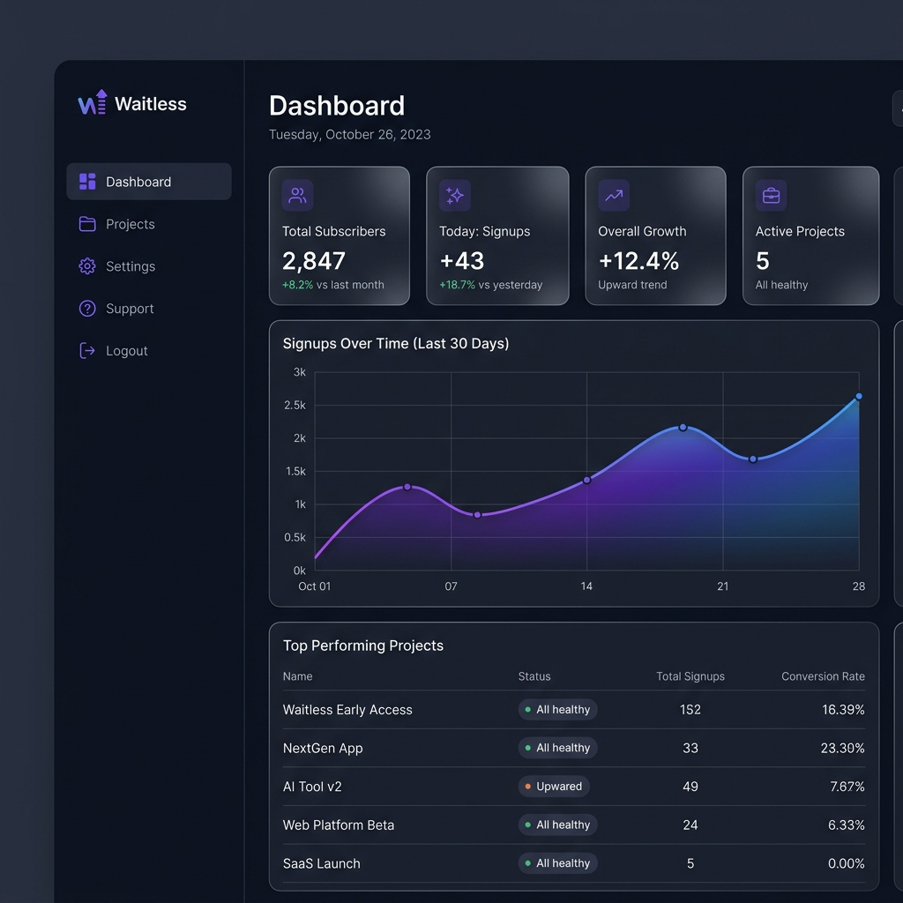
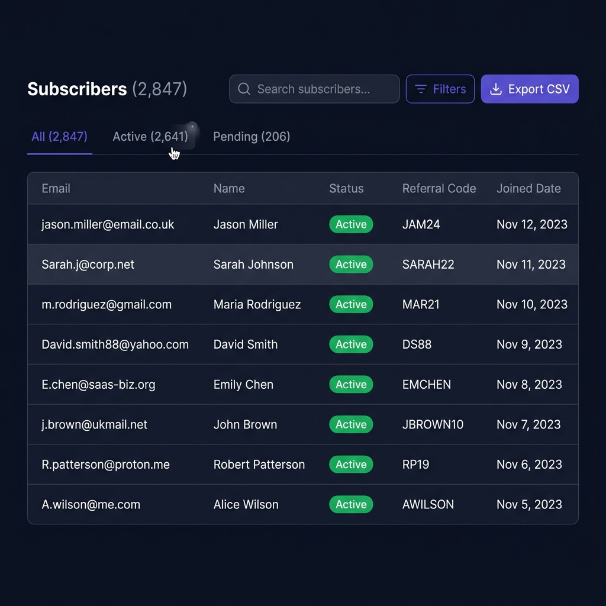
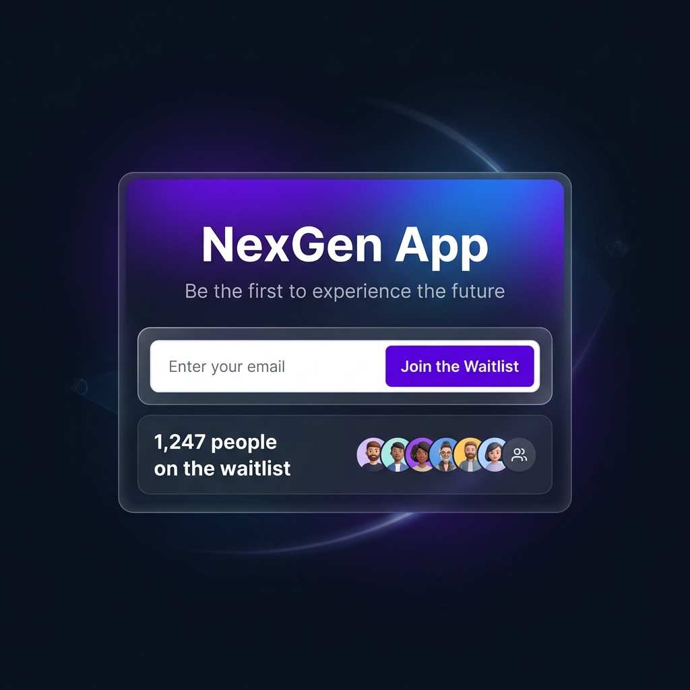

<p align="center">
  
</p>

<h1 align="center">⚡ Waitless</h1>

<p align="center">
  <strong>Open-source waitlist & launch platform — self-hosted, your own SMTP, zero lock-in.</strong>
</p>

<p align="center">
  <a href="#-quick-start"></a>
  <a href="#-features"></a>
  <a href="https://github.com/Yupcha/waitless/releases"></a>
</p>

<p align="center">
  
  
  
  
  
  
</p>

---

Waitless lets you launch beautiful waitlist pages, collect signups, and manage subscribers — all from a single self-hosted binary. No third-party email lock-in, no monthly fees, no limits.

## ✨ Features

<table>
<tr>
<td width="50%">

### 🚀 Launch
- **Public waitlist pages** — branded `/w/:slug` pages, ready to share
- **Embeddable widget** — drop a `<script>` tag into any website
- **Referral system** — unique codes for viral growth
- **Coupon engine** — reward early adopters

</td>
<td width="50%">

### 📊 Manage
- **Analytics dashboard** — signup trends, growth metrics, charts
- **Subscriber management** — search, filter, sort, bulk actions
- **CSV import/export** — migrate data in and out freely
- **Multi-project** — unlimited waitlists from one install

</td>
</tr>
<tr>
<td width="50%">

### 📧 Email
- **OAuth email** — Gmail & Zoho Mail (OAuth2, no app passwords)
- **Any SMTP** — Mailgun, SES, SendGrid, Postmark, self-hosted
- **Professional templates** — beautiful HTML welcome emails
- **Custom from name** — send as your brand

</td>
<td width="50%">

### 🔐 Platform
- **REST API** — full API with key-based auth for integrations
- **Webhooks** — real-time event push to your backend
- **Telegram notifications** — get alerted on new signups
- **Admin panel** — manage users, projects, platform-wide

</td>
</tr>
</table>

## 📸 Screenshots

<p align="center">
  
  
  
</p>
<p align="center">
  <em>Dashboard Analytics · Subscriber Management · Public Waitlist Page</em>
</p>

## 🚀 Quick Start

### Docker (Recommended)

```bash
git clone https://github.com/Yupcha/waitless
cd waitless
docker compose -f docker/docker-compose.yml up -d
```

Visit **http://localhost:8080** — the first account becomes the admin.

### From Source

```bash
# Clone
git clone https://github.com/Yupcha/waitless && cd waitless

# Configure
cp .env.example .env    # Edit with your database settings

# Build & run (single binary!)
make build
./waitless
```

> **Requirements:** Go 1.25+, Bun 1.2+, PostgreSQL 16+

### Development Mode

```bash
make dev-backend     # Terminal 1: Go server with hot reload
make dev-frontend    # Terminal 2: Vite dev server → proxies to :8080
```

## ⚙️ Configuration

### Environment Variables

| Variable | Description | Default |
|---|---|---|
| `DATABASE_URL` | PostgreSQL connection string | — |
| `PORT` | Server port | `8080` |
| `BASE_URL` | Public URL (for OAuth callbacks) | `http://localhost:8080` |
| `ENCRYPTION_KEY` | 32-byte key for encrypting tokens at rest | auto-generated |

### Email Providers

Each project configures its own email from the dashboard.

| Provider | Type | Setup |
|---|---|---|
| **Gmail** | OAuth2 | One-click connect with Google account |
| **Zoho Mail** | OAuth2 | One-click connect (supports .in/.com/.eu) |
| **Mailgun** | SMTP | `smtp.mailgun.org:587` |
| **SendGrid** | SMTP | `smtp.sendgrid.net:587` |
| **Amazon SES** | SMTP | `email-smtp.{region}.amazonaws.com:587` |
| **Postmark** | SMTP | `smtp.postmarkapp.com:587` |
| **Any SMTP** | SMTP | Your own host & port |

### OAuth2 Email (Optional)

```bash
# Gmail OAuth
GOOGLE_CLIENT_ID=your-google-client-id
GOOGLE_CLIENT_SECRET=your-google-client-secret

# Zoho OAuth
ZOHO_CLIENT_ID=your-zoho-client-id
ZOHO_CLIENT_SECRET=your-zoho-client-secret
ZOHO_DOMAIN=zoho.in   # or zoho.com, zoho.eu
```

## 🔌 REST API

All API endpoints use Bearer token or `X-API-Key` authentication.

```bash
# List subscribers
curl -H "X-API-Key: wl_your_key" \
  https://your-domain.com/api/v1/projects/:id/subscribers

# Add subscriber
curl -X POST -H "X-API-Key: wl_your_key" \
  -H "Content-Type: application/json" \
  -d '{"email":"user@example.com","name":"User"}' \
  https://your-domain.com/api/v1/projects/:id/subscribers
```

> 📖 **Full API docs:** [docs/rest-api-v1.md](docs/rest-api-v1.md) · [docs/public-api.md](docs/public-api.md)

## 🧩 Embeddable Widget

Drop this into any website to show a waitlist signup form:

```html
<div id="waitless-widget"></div>
<script src="https://your-domain.com/widget.js"
  data-project="your-project-slug">
</script>
```

## 🏗️ Architecture

```
./waitless  (single binary, ~17MB)
├── Go HTTP server (Chi)
│   ├── /api/auth/*         → Auth (register, login, sessions)
│   ├── /api/dashboard/*    → Dashboard API (authenticated)
│   ├── /api/admin/*        → Admin API (role-gated)
│   ├── /api/v1/*           → REST API (API key auth)
│   ├── /api/public/*       → Public waitlist API
│   └── /api/oauth/*        → OAuth2 callbacks (Gmail, Zoho)
└── Embedded React frontend (TanStack Router)
    ├── /                   → Landing page
    ├── /dashboard          → Management UI
    ├── /docs               → API documentation
    └── /w/:slug            → Public waitlist pages
```

**Tech stack:** Go · React 19 · TanStack Router · PostgreSQL · GORM · Recharts

## 🚢 Deploy

### VPS / Bare Metal

```bash
make build
scp waitless .env user@server:/opt/waitless/

# On server
cd /opt/waitless && ./waitless
```

### Docker

```bash
docker compose -f docker/docker-compose.yml up -d
```

### Systemd Service

```ini
[Unit]
Description=Waitless
After=postgresql.service

[Service]
WorkingDirectory=/opt/waitless
ExecStart=/opt/waitless/waitless
Restart=always

[Install]
WantedBy=multi-user.target
```

## 🤝 Contributing

Contributions welcome! See [CONTRIBUTING.md](CONTRIBUTING.md).

1. Fork the repo
2. Create a branch (`git checkout -b feature/amazing`)
3. Commit & push
4. Open a Pull Request

## 📜 License

MIT — see [LICENSE](LICENSE)

---

<p align="center">
  <sub>Built with ❤️ for the open-source community</sub>
</p>
